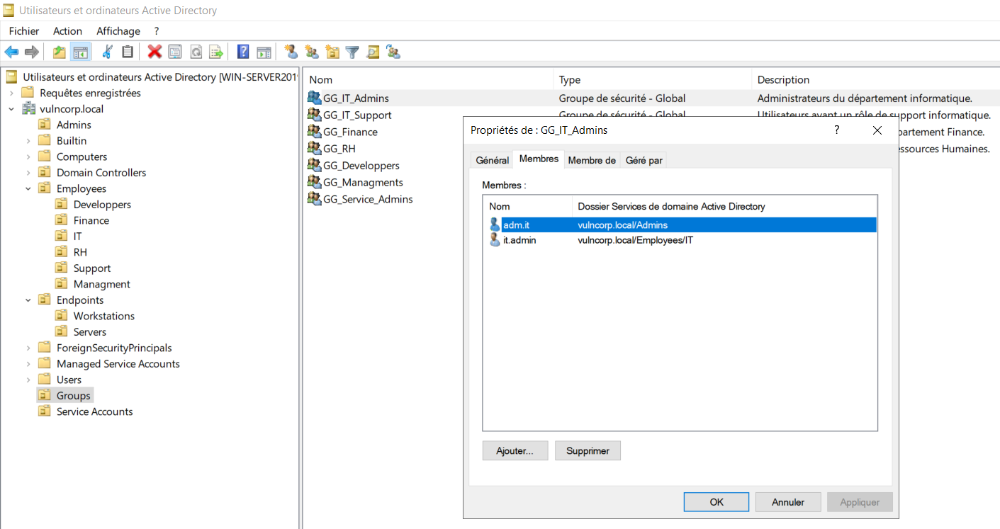
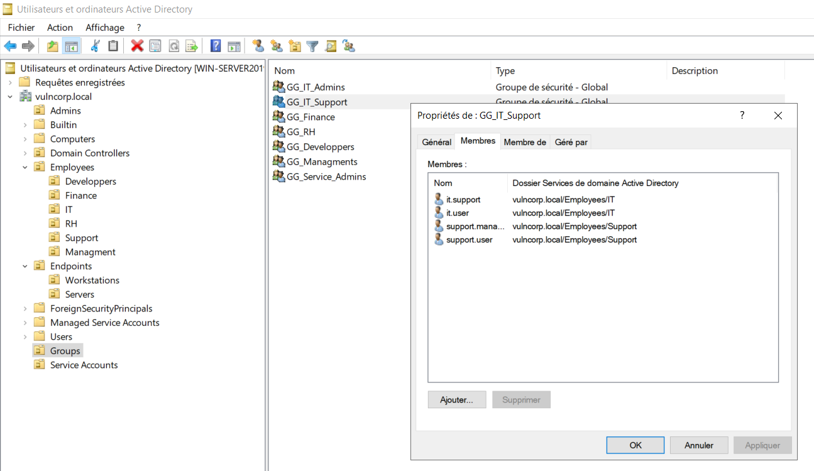
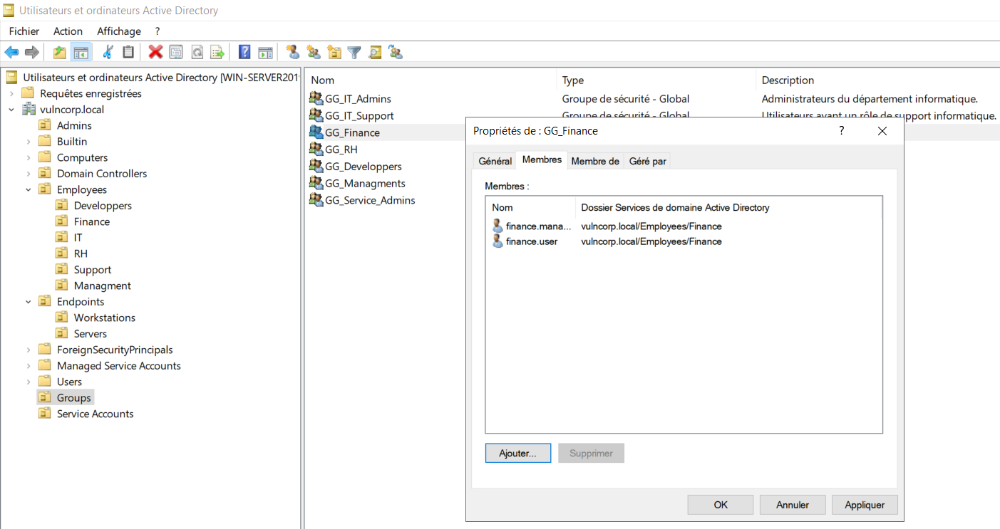
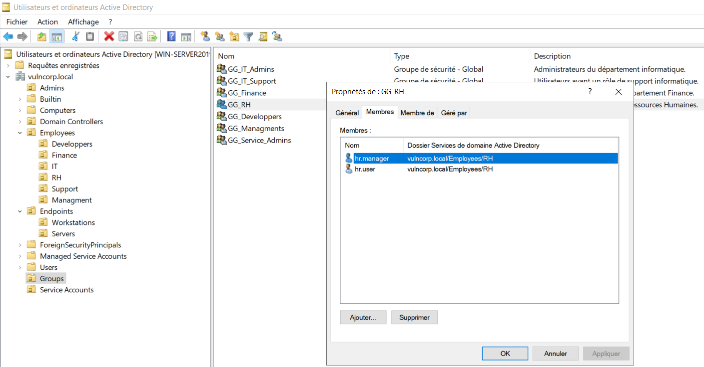
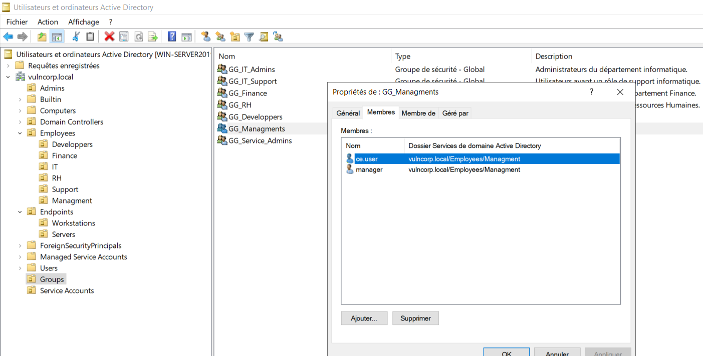

# 👥 Active Directory Group Membership

## 📌 Présentation

Cette étape consiste à associer les comptes utilisateurs créés précédemment aux **Security Groups** correspondants dans l'environnement Active Directory **VulnCorp**.

Lors de l'étape précédente (**Users Creation**), les comptes utilisateurs ont été créés et organisés dans leurs **Organizational Units (OU)** respectives.

Cette phase permet maintenant de définir l'appartenance des utilisateurs aux **Global Groups** selon leurs rôles dans l'entreprise.

---

# 🎯 Objectifs

Cette étape a pour objectifs :

- Associer les utilisateurs aux Global Groups appropriés.
- Organiser les accès selon les rôles métiers.
- Préparer l'implémentation du modèle **AGDLP**.
- Éviter l'attribution directe de permissions aux utilisateurs.

---

# 🌐 Active Directory Environment

Domaine :

```
vulncorp.local
```

Organizational Unit utilisée :

```
OU=Groups
```

---

# 🔐 Group Management Model

Le laboratoire utilise une approche basée sur :

```
AGDLP
```

Signification :

```
Accounts

    ↓

Global Groups

    ↓

Domain Local Groups

    ↓

Permissions
```

Cette étape correspond uniquement à la relation :

```
Accounts

    ↓

Global Groups
```

---

# 👥 Global Groups Membership

## 🖥️ IT Department

### GG_IT_Admins

Membres :

| Username | Role |
|---|---|
| it.admin | Infrastructure Administrator |
| adm.it | IT Administrator |

---

### GG_IT_Support

Membres :

| Username | Role |
|---|---|
| it.support | IT Support Technician |
| it.user | IT User |
| support.manager | Support Manager |
| support.user | Support Agent |
| adm.support | Support Administrator |

---

# 💰 Finance Department

## GG_Finance

Membres :

| Username | Role |
|---|---|
| finance.manager | Finance Manager |
| finance.user | Finance Employee |

---

# 👥 Human Resources Department

## GG_HR

Membres :

| Username | Role |
|---|---|
| hr.manager | HR Manager |
| hr.user | HR Employee |

---

# 💻 Developers Department

## GG_Developers

Membres :

| Username | Role |
|---|---|
| dev.lead | Development Lead |
| dev.user | Developer |

---

# 🏢 Management Department

## GG_Management

Membres :

| Username | Role |
|---|---|
| ceo.user | Executive User |
| manager.user | Department Manager |

---

# 🔐 Domain Administration

Le compte d'administration du domaine est séparé des comptes utilisateurs standards.

Compte :

```
adm.domain
```

Groupe :

```
Domain Admins
```

Ce compte sera utilisé uniquement pour les opérations d'administration du domaine.

---

# 📷 Group Membership Screenshots

Les captures suivantes montrent l'association des utilisateurs aux différents Global Groups.

## GG_IT_Admins



---

## GG_IT_Support



---

## GG_Finance



---

## GG_HR



---

## GG_Developers


---

## GG_Management



---

# 🔒 Security Perspective

L'utilisation des Global Groups permet de centraliser la gestion des rôles utilisateurs.

Les utilisateurs ne possèdent pas encore de permissions directement attribuées.

La logique appliquée est :

```
User Account

        ↓

Global Group

        ↓

Future Resource Access
```

Cette organisation facilite :

- l'administration des comptes ;
- la gestion des rôles ;
- l'audit des privilèges.

Elle sera également utilisée lors des futures phases de Pentest Active Directory pour analyser les relations entre utilisateurs, groupes et privilèges.

---

# 📚 Skills

- Active Directory Security Groups
- Group Membership Management
- Identity Management
- AGDLP Preparation
- Access Control Fundamentals

---

# 🚀 Next Step

La prochaine étape consistera à mettre en place le contrôle d'accès aux ressources.

Cette phase inclura :

- Domain Local Groups ;
- SMB Shares ;
- NTFS Permissions ;
- Implémentation complète du modèle AGDLP.

Objectif :

```
Global Group

        ↓

Domain Local Group

        ↓

Resource Permission
```
